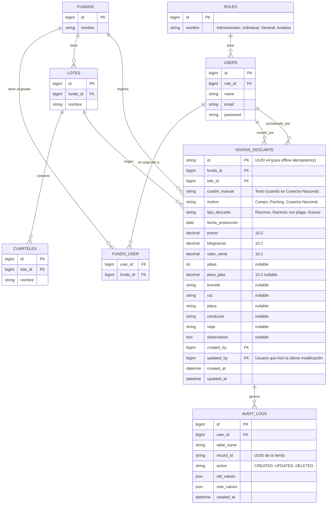

# Modelo de Datos (Entidad-Relación) y Políticas de Acceso

## 1. Diagrama ER Lógico

## 2. Normalización y Decisiones Técnicas
- **UUID en Ventas:** Se usará UUID v4 como Primary Key en `ventas_descarte` para permitir la generación en la PWA (Offline) y evitar colisiones de IDs al sincronizar.
- **Cuarteles:** Aunque existe la tabla `CUARTELES` para mantener un catálogo estructurado (perteneciente a `LOTES`), en la tabla de `ventas_descarte` se guardará el texto en `cuartel_manual` para dar flexibilidad al ingreso manual si el motivo es "Cosecha Nacional".
- **Decimales:** Todos los montos y pesos se definen como `DECIMAL(10,2)`. El cálculo se hará en frontend y se verificará en backend.
- **Auditoría:** La tabla `audit_logs` guardará el historial de cambios inmutables. Además, `ventas_descarte` conservará `created_by` y `updated_by`.

## 3. Políticas de Acceso y Aislamiento por Fundo (Multi-tenant)
- **Global Scopes (Laravel):** Se implementará un `FundoScope` global en el modelo `VentaDescarte` y `Lote`.
  - Si el usuario logueado es **Individual** o **General**, el query de base de datos añadirá automáticamente `WHERE fundo_id IN (...)` garantizando que NUNCA puedan consultar o modificar datos ajenos, independientemente de la URL a la que accedan.
  - El rol **Analista** se exceptuará del Scope, permitiéndole ver los registros de todos los fundos.
  - Las validaciones de Form Requests (Backend) impedirán insertar registros con un `fundo_id` o `lote_id` no asignado al usuario.
